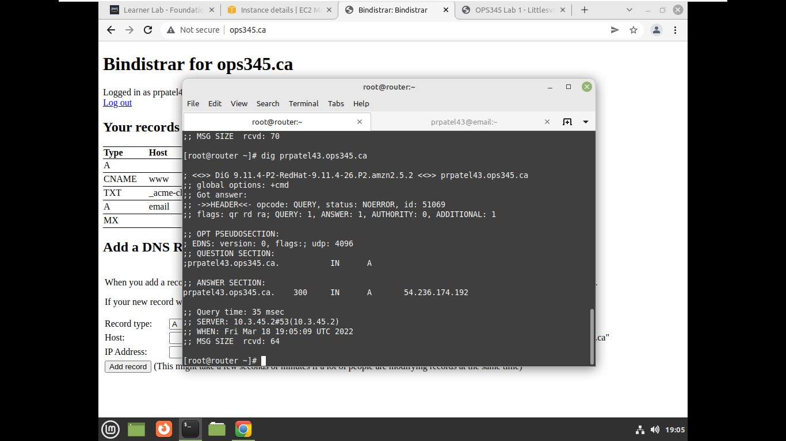
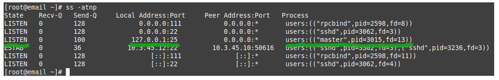

* Make a new virtual machine.
*  add 4GB EBS volume that won't be automatically erased if the VM is deleted.
*  security group called emailsg that only permits SMTP access from the router and SSH access from anyplace.
* To SSH to email using port 22 on the router, configure port forwarding. Although the email server will have a unique public IP address, keep in mind that we're pretending to be keeping an eye on all SSH communication using specialised software on the router computer.
* Create a brand-new, dedicated static IP address with the name "email public ip" and connect it to your email server.
* Use the static IP you gave your email server to create an A record for email.domain.ca and create  just a normal A record.

* Put the value email.domain.ca in an MX record.

* In order to prevent losing our website in the event that the server was destroyed or damaged, we put up an external storage device.

* On Amazon Linux, Postfix is already installed, however it only listens on localhost and refuses inbound connections to port 22, even though the firewall permits access to that port.
