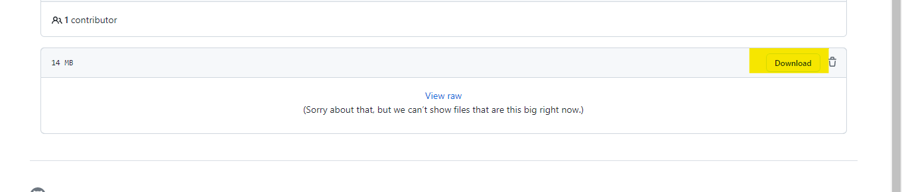

* In this project, I created three virtual machine.
    * first is admin,Which handle my active directory.
    * Second is webserver and in which I have created IIS server
    * last is client server,which i make for just to check my webserver page is opening in other device or not.
* You can watch my video by clicking on below link :-
* Then click on download link shown in picture below.
