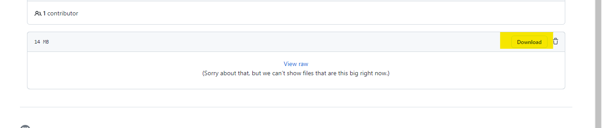

### Part A
1.	In a browser, load a webpage from your Apache server
2.	Transfer a file via FTP to your client
3.	RDP into your Windows server
4.	SSH into your router
5.	Login to your MySQL database server

#### Ip table file link :- https://github.com/pratham72/Project/blob/main/Trafic_managment/file_and_video/scenario5-1.sh.txt

### Part A2
1.	APACHE by destination port
2.	MySQL by source port
3.	SSH to LS-XX by destination port

#### Ip table file link :- https://github.com/pratham72/Project/blob/main/Trafic_managment/file_and_video/Final-Eval-1.sh

### Part B
1.	In a browser, load a webpage from your IIS server
2.	RDP into your Windows server
3.	SSH into your Linux server
4.	Login to your MySQL database server

#### Ip table file link :- https://github.com/pratham72/Project/blob/main/Trafic_managment/file_and_video/scenario5-2.sh.txt

### Part B2
1.	SSH to your Linux server by source port
2.	RDP to your Windows server by source port

#### Ip tabel file link : - https://github.com/pratham72/Project/blob/main/Trafic_managment/file_and_video/Final-Eval-2.sh

You can see my video presentation by following link :- https://github.com/pratham72/Project/blob/main/Trafic_managment/file_and_video/Pratham's%20Final%20evalution%20presentation%20of%20CSN500.webm

* Then click on download link shown in picture below.

